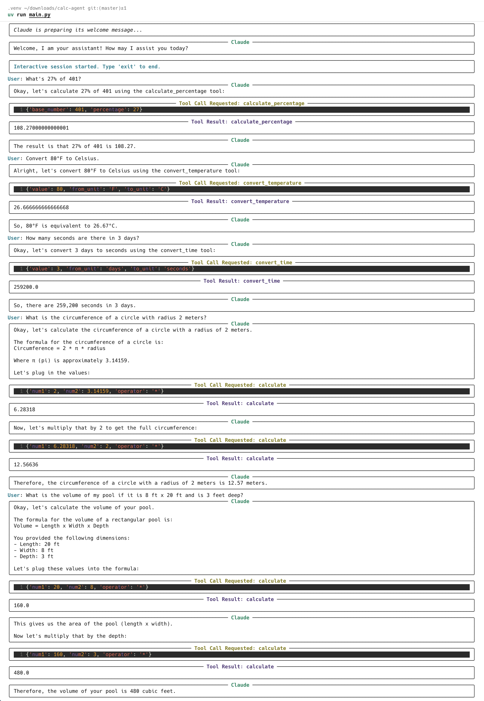

# Calc Agent - A Claude-powered AI Assistant with Tool Use

## Overview
Calc Agent is a Python-based AI assistant that uses Anthropic's Claude API to handle mathematical calculations, unit conversions, and other utility tasks in a conversational manner. The agent is built without relying on any AI framework (like LangChain or OpenAI Agents), implementing a custom tool execution system and conversation loop.

## Features
- Conversational interface powered by Claude
- Asynchronous processing for responsive interactions
- Custom tool system for handling specialized tasks:
  - Basic arithmetic calculations
  - Percentage calculations
  - Temperature conversions (Celsius/Fahrenheit)
  - Time unit conversions
  - Directory creation
  - HTML generation
  - Planning assistance

## Example Queries
The agent can handle queries such as:
- "What's 27% of 401?"
- "Convert 80°F to Celsius."
- "How many seconds are there in 3 days?"
- "What is the volume of my pool if it is 8 ft x 20 ft and is 3 feet deep?"
- "What is the circumference of a circle with radius 2 meters?"

## Installation

### Prerequisites
- Python 3.8+
- Anthropic API key

### Setup
1. Clone this repository
2. Install dependencies:
   ```
   uv venv
   source .venv/bin/activate
   uv pip install -r requirements.txt
   ```
3. Create a `.env` file in the project root with your Anthropic API key:
   ```
   CLAUDE_API_KEY=your_api_key_here
   ```

## Usage
Run the application with:

```
uv run main.py
```

## Screenshots


